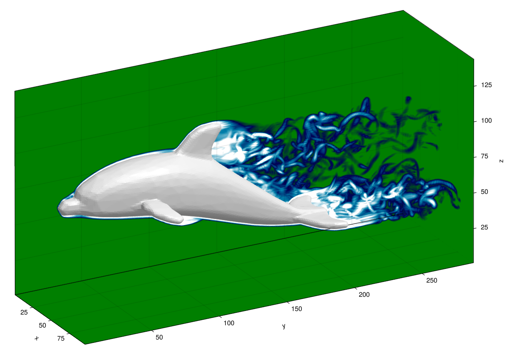

# WaterLilyMeshBodies

[](https://github.com/WaterLily-jl/WaterLilyMeshBodies.jl/actions/workflows/CI.yml)



`WaterLilyMeshBodies` is a companion package to [WaterLily.jl](https://github.com/WaterLily-jl/WaterLily.jl) that defines a `MeshBody` type and a few `measure`ment functions that compute the signed distance, surface normal, and surface velocity as needed for a WaterLily simulation. The function runs in $O(\log N)$ time through the use of a Bounding Volume Hierarchy, and works on any backend (single or multi-threaded CPU and GPU).

### Installation

The package is registered, so you can add it simply using

```julia
] add WaterLilyMeshBodies
```

### Usage

#### Static mesh body

The simplest way to initialize a `MeshBody` is using an [stl file](https://en.wikipedia.org/wiki/STL_(file_format)) describing the body as a triangle mesh
```julia
using WaterLily, WaterLilyMeshBodies, StaticArrays, CUDA

L = 64; T = Float32
body = MeshBody(joinpath(@__DIR__, "mesh.stl");
    scale = T(L),          # scale mesh to simulation units
    map = (x,t) -> x .- L, # centre the body in the domain
    boundary = true,       # closed surface (determines sign of SDF)
    mem = CUDA.CuArray)    # run on GPU
```
Note that WaterLily simulations use a unit-voxel grid, so you will need to scale and map your mesh geometry appropriately. See the WaterLily [examples repository](https://github.com/WaterLily-jl/WaterLily-Examples) for details and many examples.

Once the body is defined, it can be passed to the WaterLily `Simulation` constructor and used as normal
```julia
sim = Simulation((4L,2L,2L), (1,0,0), L; body, ν=1e-3, T, mem=CUDA.CuArray)
sim_step!(sim, 1.0, remeasure=false) # simulate flow around the static mesh
```

The `MeshBody` can also be initialized using any `GeometryBasics.Mesh` directly. Internally, any mesh is converted to a triangle mesh, so non-triangular faces will be triangulated.

> [!NOTE]
> WaterLily simulations use a unit-voxel grid, so you will need to scale and map your mesh geometry appropriately. See the WaterLily [examples repository](https://github.com/WaterLily-jl/WaterLily-Examples) for details and many examples.

#### Deforming mesh body

To translate or deform a mesh, call `update!` each time step with the new triangle coordinates and the time step size:

```julia
body = update!(body, new_mesh, dt)  # updates positions and derives surface velocity
```

Vertex velocities are computed as $(x_\text{new} - x_\text{old})/\Delta t$ and are used by WaterLily to apply the no-slip boundary condition on moving surfaces.

For cases where the motion or deformation consists of different snapshots of the mesh at different times, you can create a `MotionInterpolation` object allow `WaterLily` to sample (`interpolate!`) the body at any time `t` during the simulation
```julia
# periodic motion data
times = 0:0.01:1 .* sim.L
motion_itp = MotionInterpolation(motion_data, times; periodic=true)

# interpolate at the required time during the simulation
for tᵢ in range(0, 2, step=0.02)
    while sim_time(sim) < tᵢ
        sim.body = interpolate!(sim.body, motion_itp, WaterLily.time(sim))
        sim_step!(sim; remeasure=true)
    end
end
```
where the `motion_data` 2D Array with dimensions `[N_snapshots × N_elements]`, where each element is a `SMatrix{3,3}` of each triangle position. Each snapshot corresponds to the time in the `times` array. The `periodic=true` flag allows the interpolation to wrap around from the last snapshot back to the first, which is useful for periodic motions.

> [!WARNING]
> The `update!` and `interpolate!` functions require that their output is reassigned to the existing `body` variable to take full effects.

#### `MeshBody` keyword arguments:

| Argument | Default | Description |
|---|---|---|
| `scale` | `1f0` | Scale factor applied to mesh coordinates |
| `map(x,t)` | identity | Coordinate mapping from simulation space to mesh space |
| `boundary` | `false` | `true` for closed watertight surfaces; `false` for open/shell surfaces |
| `size` | `nothing` | WaterLily simulation size to create a flood-fill cache |
| `half_thk` | `1.866f0` | Half-thickness (in grid cells) when `boundary=false` |
| `mem` | `Array` | Memory backend: `Array`, `CUDA.CuArray`, etc. |
| `primitive` | `BBox` | Bounding volume type for the BVH: `BBox` (default) or `BSphere` |

### Method

Closest-triangle queries are accelerated by a Bounding Volume Hierarchy (BVH) built with [ImplicitBVH.jl](https://github.com/JuliaArrays/ImplicitBVH.jl), reducing each query from $O(N)$ to $O(\log N)$ where $N$ is the number of triangles. 

The default `boundary=false` results in a open/shell body with finite half-thickness `half_thk`. Setting `boundary=true` attempts to create a closed body signed distance function with $d<0$ internally. The sign is determined by flood-fill starting at the mesh's bounding box and working-in, but this can fail if the normals aren't outward facing or if the mesh isn't "water-tight". Initializing the `MeshBody` with the WaterLily simulation `size` will build a flood-fill cache, speeding up repeated remeasurement for moving meshes. 

The surface velocity at the closest point is interpolated from the triangle's vertex velocities using barycentric shape functions.

